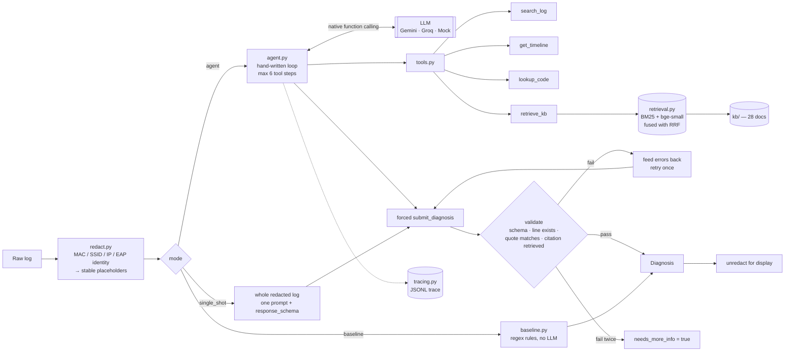

# wifi-doctor

**An LLM agent that reads a `wpa_supplicant` log and tells you why the Wi-Fi failed — and
shows you the exact lines it used as proof.**

- **Live demo:** _TODO — paste your Hugging Face Space URL here after the first deploy._
- **Screenshot:** _TODO — run `python app.py`, open <http://127.0.0.1:7860>, and save a
  screenshot to `docs/screenshot.png`; this line becomes ``._

Wi-Fi logs are long, repetitive and mostly noise, and the one line that matters is usually
indistinguishable from the twenty that do not. `wifi-doctor` gives a model four tools, a
small knowledge base, and no direct access to the log, then refuses to accept any answer
whose citations it cannot verify.

```
 in:  200 lines of wpa_supplicant / kernel / dhclient output  (test_0023)
out:  HANDSHAKE_TIMEOUT          confidence 1.0      6 API requests, 38.7k tokens

      tools called   get_timeline → search_log → lookup_code(reason,15)
                     → retrieve_kb → search_log

      evidence       line 24  CTRL-EVENT-SIGNAL-CHANGE above=0 signal=-89 noise=-89 txrate=6000
                     line 25  WPA: EAPOL-Key timeout
                     line 31  deauthenticated from <MAC_2> (Reason: 15=4WAY_HANDSHAKE_TIMEOUT)

      kb_citations   troubleshoot-handshake-timeout, disambiguation-guide, reason-codes
```

That log also contains `WPA: 4-Way Handshake failed - pre-shared key may be incorrect` —
the line a keyword matcher fires on. The agent did not take the bait: the signal is
−89 dBm, the EAPOL-Key frames timed out, and there is no `reason=WRONG_KEY`. Every field
above is copied from the real trace at
[`docs/sample_traces/agent_test_0023.jsonl`](docs/sample_traces/); the identifiers are
placeholders because that is genuinely all the model ever saw.


---

## Architecture



The whole loop is about forty lines in [`src/wifi_doctor/agent.py`](src/wifi_doctor/agent.py).

---

## Results

<!-- RESULTS:START -->
Provider **gemini**, model **`gemini-3.5-flash-lite`**, run on **2026-09-25** against the held-out **test** split (33 logs, 245 API requests). Retrieval backend: hybrid (`BAAI/bge-small-en-v1.5`).

| metric | rule baseline | single-shot | agent |
|---|---|---|---|
| root-cause accuracy | 75.8% | 84.8% | 93.9% |
| macro-F1 | 0.697 | 0.817 | 0.938 |
| evidence precision | 82.8% | 62.1% | 68.2% |
| evidence recall | 44.9% | 45.8% | 49.2% |
| hallucinated evidence | 0.0% | 0.0% | 0.0% |
| HEALTHY false-alarm rate | 33.3% | 0.0% | 0.0% |
| missed-failure rate | 3.3% | 10.0% | 3.3% |
| schema-valid, first try | 100.0% | 100.0% | 93.9% |
| schema-valid, after retry | 100.0% | 100.0% | 100.0% |
| API requests / log | 0.00 | 1.00 | 6.42 |
| tokens / log | 0 | 11,011 | 44,041 |
| median latency / log | 0.0s | 2.4s | 25.4s |

Full report with per-class breakdowns, confusion matrices and the worst failures: [`results/2026-09-25_gemini_gemini-3.5-flash-lite/report.md`](results/2026-09-25_gemini_gemini-3.5-flash-lite/report.md).
<!-- RESULTS:END -->

### Coverage, and why it is 33 logs and not 66

The test split has 66 logs. The agent completed 37 of them before the run hit Google's
free-tier ceiling of **500 requests per day per model** — a number the API told me itself:

```
429 RESOURCE_EXHAUSTED  quotaId "GenerateRequestsPerDayPerProjectPerModel-FreeTier"
                        model "gemini-3.5-flash-lite"  quotaValue "500"
```

That is exactly the default `LLM_RPD` in `.env.example`, and the client-side limiter would
have stopped the run cleanly at 500. I overrode it with `--rpd 1400` on a guess about the
tier, so the run sailed past the local guard and hit the server-side wall instead. The
client-side limiter was right and the override was wrong; `eval/run_eval.py` now warns when
`--rpd` is raised above a verified ceiling, and `config.py` records the verified values.

So that the three modes stay comparable, **all of them are reported on the same first 33
logs** — a balanced prefix of 3 per class, since the generator cycles the label set. The six
cases that errored on quota were deleted from the resume cache rather than scored, so no
429 is counted as a wrong answer. To finish the remaining 33 logs once the quota resets,
re-run the same command without `--limit`; the cache means only the unfinished cases cost
anything:

```bash
python eval/run_eval.py --split test --modes baseline single_shot agent \
    --provider gemini --model gemini-3.5-flash-lite
python scripts/update_readme_results.py results/<run>/metrics.json
```

**Every number above came from actually running `eval/run_eval.py`** against the real API on
the date shown, and is regenerated into this README straight from that run's `metrics.json`
by `scripts/update_readme_results.py`. Nothing here is estimated.

**What the metrics mean**

- *Evidence precision/recall* compare the line numbers the model cited against the
  generator's ground-truth evidence lines, micro-averaged over the non-`HEALTHY` cases.
- *Hallucinated evidence* is the share of returned citations whose line number does not
  exist or whose quote does not occur on the cited line. Validation runs before the answer
  is returned, so this measures what got through, not what was first attempted.
- *HEALTHY false-alarm rate* is how often a perfectly fine log was given a fault. A
  confident false alarm costs a support engineer more than no answer at all, so it is
  tracked separately from accuracy.
- *Schema-valid first try vs after retry* separates "the model got it right immediately"
  from "the validator caught it and the retry fixed it".

---

## Design decisions

**Why a hand-written agent loop rather than a framework.** The loop is short, and every
decision that matters in this project lives inside it: when tool calls stop and the final
answer is forced, what counts as a valid answer, what exactly gets fed back on a retry, and
what lands in the trace. A framework would hide precisely those decisions behind defaults
that I would then have to explain anyway. Forty lines I can defend beat four hundred I
inherited.

**Why the model cannot see the log.** In agent mode the log is only reachable through
`search_log` and `get_timeline`. That is not a limitation, it is the mechanism: a model that
has never been shown line 88 cannot casually claim line 88 says something. Every citation
has to come back through a tool that returns real line numbers.

**Why a forced `submit_diagnosis` function instead of a response schema.** Gemini rejects
`tools` and `response_schema` in the same request — verified against `gemini-3.5-flash-lite`
on 2026-09-25, not assumed. Since agent mode needs the tools attached right up to the final
turn, the structured answer comes from a forced function call
(`mode="ANY", allowed_function_names=["submit_diagnosis"]`) whose parameter schema *is* the
Pydantic model. Single-shot mode has no tools, so it uses the native `response_schema`
instead. Both of Gemini's structured-output mechanisms are live in the codebase, each where
it actually fits.

**Why hybrid retrieval.** Wi-Fi troubleshooting is full of exact tokens — `status_code=17`,
`EAPOL-Key`, `Reason: 15` — and a dense model maps status 17 and status 27 to nearly the
same vector. BM25 does not. But a user typing "it keeps asking for the password again"
shares no tokens with the document that answers them, and BM25 is helpless there. Neither
retriever is sufficient, so both run and their rankings are fused with **Reciprocal Rank
Fusion**, which needs no score normalisation between two retrievers whose scores are on
incomparable scales. Embeddings are optional at runtime: if `sentence-transformers` is
missing or the model cannot be fetched, retrieval degrades to BM25-only and says so.

**Why validation and retry, rather than trusting the output.** A diagnosis nobody can check
is worth nothing in a support workflow. Three checks turn "the model said so" into something
falsifiable: the payload must parse as the Pydantic model; every cited line number must exist
*and* the quote must actually occur on that line; and every `kb_citation` must be a document
that was genuinely retrieved during this run. On failure the specific errors — including the
real text of the line that was misquoted — go back to the model for exactly one retry. If it
fails twice, the run returns `needs_more_info=true` rather than a confident guess.

This is not theoretical. On the reported run the guardrail fired on 2 of 33 agent cases
(schema-valid first try 93.9%, 100% after retry). In
[`docs/sample_traces/agent_test_0006_validation_retry.jsonl`](docs/sample_traces/) the model
cited a NetworkManager line with the right process name, the right log format and a
plausible timestamp — that did not exist. The validator compared the quote to line 41 and
rejected it with the line's real text; the retry produced a correct, checkable answer. That
is a hallucinated citation caught and repaired automatically, and it is exactly the failure
mode a diagnosis tool cannot afford to ship.

**Why redaction happens before anything is sent.** Free-tier LLM APIs generally reserve the
right to use submitted prompts to improve their products, so anything sent to one should be
treated as published. A Wi-Fi log is not neutral: a BSSID plus an SSID is a geolocatable
fingerprint — that is exactly how public BSSID-location databases are built — and an EAP
identity is somebody's username. So MACs, SSIDs, IPv4/IPv6 addresses, EAP identities,
certificate subjects, syslog usernames and hostnames are all replaced with stable
placeholders (`<MAC_1>`, `<SSID_1>`, …) *before* the text reaches a provider. Placeholders
are stable within a document, so the model can still reason about "the same AP as before",
which is most of what the identifiers were for. The mapping back to the real values stays in
the process, is never written to a trace, and is used only to render the answer for the
person who owns the log. The demo's *What was sent to the LLM* tab shows the operator the
exact bytes that left the machine.

Protocol constants such as `255.255.255.255` are deliberately **not** redacted — replacing
them would destroy meaning (a `DHCPDISCOVER` must go to the broadcast address) and protect
nobody.

One of the redaction tests, run over the whole corpus rather than over handpicked strings,
caught a real leak: the SSID reappearing inside a RADIUS certificate subject in
`CTRL-EVENT-EAP-PEER-CERT`, which no other pattern covered. That case is now a regression
test.

**Why a good-faith regex baseline.** It would be easy to make the LLM look good by comparing
it to a strawman. The baseline in `baseline.py` encodes the disambiguations a competent
engineer would write after a week of reading supplicant output — `WRONG_KEY` before EAPOL
timeouts, a roam attempt before a generic association rejection, `locally_generated=1` to
tell "we left" from "we were kicked". It is a real bar, and if the agent cannot clear it,
the agent is not worth its API calls.

---

## Limitations

- **The logs are synthetic.** They are format-faithful — real control-event names, real
  supplicant states, real IEEE 802.11 reason and status codes — but they are generated, not
  captured. A model that does well here has learned the format and the reasoning, which is
  necessary but not sufficient for real captures. See [`data/README.md`](data/README.md).
- **Eleven classes, one label per log.** Real failures overlap and cascade; a single
  mutually-exclusive root cause is a modelling simplification that makes accuracy and
  macro-F1 well defined at the cost of realism.
- **WPA2-Personal and 802.1X centric.** WPA3/SAE is documented in the knowledge base but is
  not a generated class, and SAE fails at a different point in the state machine
  (`AUTHENTICATING`, not `4WAY_HANDSHAKE`), so the trained intuitions do not transfer.
- **English-only knowledge base**, and English-only prompts.
- **Small reported sample.** 33 logs, 3 per class (see *Coverage* above). With 3 examples per
  class, a single case is 3 percentage points of accuracy and one whole point of per-class
  recall. The ordering baseline < single-shot < agent is consistent across accuracy,
  macro-F1, false-alarm rate and evidence recall, but the individual gaps are not
  statistically meaningful at this size. Treat the table as directional, not as a leaderboard.
- **Confidence is not calibrated.** On the reported run the agent's mean confidence was
  **1.00 when it was right and 1.00 when it was wrong**, and it never set
  `needs_more_info` of its own accord. The `confidence` field is currently decorative;
  do not gate anything on it. The rule baseline is no better (0.79 vs 0.78). Making
  confidence mean something — verbalised uncertainty, self-consistency across samples, or
  a calibrated head over the evidence count — is the most valuable next piece of work here,
  and the evaluation harness already measures it.
- **One model, one day.** Everything was measured on a single provider and model on the date
  recorded, with temperature 0. No repeated-run variance is reported.
- **The agent's token cost grows with the conversation.** Tool results are resent on every
  turn, so a 400-line log with a long tool phase is markedly more expensive than a short one.

---

## Run it

Python 3.11+.

```bash
git clone https://github.com/<you>/wifi-doctor && cd wifi-doctor
python -m venv .venv && source .venv/bin/activate
pip install -r requirements-dev.txt
pip install -e .

cp .env.example .env        # then put your free Gemini key in it
python scripts/generate_logs.py
```

Get a free key at <https://aistudio.google.com/apikey>. `.env` is gitignored and no key is
ever printed, logged or written to a trace.

**The demo:**

```bash
python app.py               # http://127.0.0.1:7860
```

**One log from the command line:**

```python
from wifi_doctor.agent import diagnose
from wifi_doctor.config import get_settings
from wifi_doctor.llm import build_provider

result = diagnose(open("my.log").read(), build_provider(get_settings()))
print(result.display().model_dump_json(indent=2))
```

**The evaluation:**

```bash
# prints the estimated API-request count and refuses to start if it will not
# fit in today's remaining free-tier budget
python eval/run_eval.py --split test --modes baseline single_shot agent \
    --provider gemini --model gemini-3.5-flash-lite

python eval/run_eval.py --split test --limit 10        # a small chunk
python eval/run_eval.py --split test --modes baseline  # no API calls at all
python eval/run_eval.py --split dev --provider mock    # fully offline

python scripts/update_readme_results.py results/<run>/metrics.json
```

Every finished case is cached under `results/<run>/cache/`, so an interrupted run resumes
exactly where it stopped and never pays for the same log twice. A client-side rate limiter
paces requests (`LLM_RPM`) and a persisted daily counter enforces `LLM_RPD`; 429s are retried
with exponential backoff, honouring the provider's own `retryDelay` hint when it sends one.

**Tests:**

```bash
pytest -q          # 125 tests, fully offline (MockProvider, BM25-only retrieval)
                   # 11 of them need gradio and skip without it, as CI does
ruff check . && ruff format --check .
```

---

## Deploying to Hugging Face Spaces

1. Create a Space: **New Space** → SDK **Gradio**, hardware **CPU basic (free)**.
2. In the Space's **Settings → Variables and secrets**, add a secret named
   `GEMINI_API_KEY`. Optionally add `DEMO_MAX_RUNS_PER_SESSION` and `DEMO_DAILY_CAP` as
   plain variables.
3. Create a Hugging Face **write** token at <https://huggingface.co/settings/tokens>.
4. In the GitHub repo: **Settings → Secrets and variables → Actions** → add the secret
   `HF_TOKEN`, and add a repository *variable* `HF_SPACE` set to `<your-username>/wifi-doctor`.
5. Push to `main`. `.github/workflows/sync-to-hf.yml` mirrors the repo into the Space, and
   the Space builds from the YAML front matter at the top of this README.

The front matter is what makes this file serve double duty as the Space card; that is the
standard "sync to hub" pattern and is why it is here rather than in a separate folder.

---

## Repository layout

```
src/wifi_doctor/
  schema.py      Pydantic Diagnosis model + the flat JSON Schema given to the provider
  redact.py      identifier → placeholder, and back again for display
  logparse.py    line-number-preserving parsing, and smart truncation for long logs
  tools.py       search_log, get_timeline, lookup_code, retrieve_kb
  retrieval.py   BM25 + embeddings, fused with RRF, dense index cached to disk
  llm.py         provider interface + Gemini, Groq and a deterministic Mock
  agent.py       the loop, the validator, and the single-shot ablation
  prompts.py     system and retry prompts (tuned on dev only)
  tracing.py     JSONL traces
  ratelimit.py   RPM sliding window + persisted RPD counter
  baseline.py    the regex rules the agent has to beat
  config.py      settings from .env; never prints a key

kb/              28 markdown docs: 802.11 code tables, state machine, per-class notes
data/synthetic/  dev (44) and test (66) cases with ground-truth evidence line numbers
scripts/         log generator; README results injector
eval/            metrics + the evaluation CLI
tests/           125 offline tests
docs/            sample traces
app.py           the Gradio demo
```

A trace is one JSONL file per run — `run_start`, then `llm_call` / `tool_call` /
`validation` events in order, then `run_end` with the totals. Samples:
[`docs/sample_traces/`](docs/sample_traces/).

---

## License

MIT.
