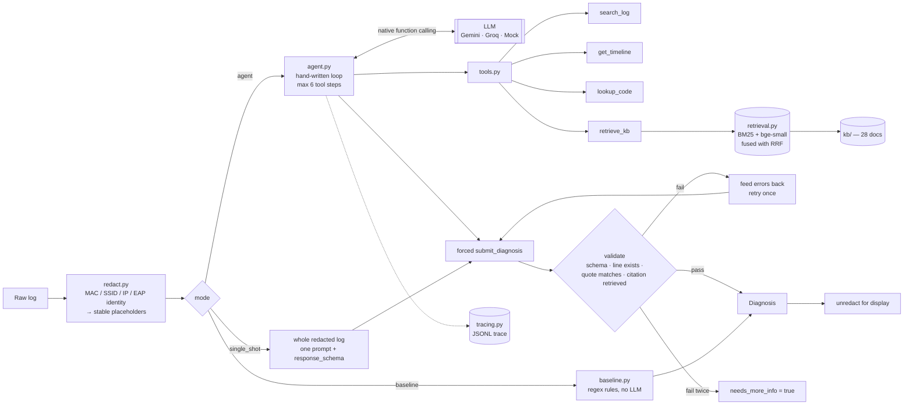

# wifi-doctor

**An LLM agent that reads a `wpa_supplicant` log, tells you why the Wi-Fi failed, and cites the
exact log lines it used as evidence.**

**Live demo:** https://wifi-doctor.streamlit.app

The demo runs `gemini-3.1-flash-lite` with BM25-only retrieval to stay within the free quota, while
the evaluation below used `gemini-3.5-flash-lite` with hybrid retrieval.


**Highlights**

- **93.9% accuracy / 0.938 macro-F1** on 33 held-out logs, against 84.8% for a single-prompt LLM and
  75.8% for a hand-written regex baseline.
- **0% false alarms** on healthy logs and **0% hallucinated evidence**; output is schema-valid
  93.9% of the time on the first try and 100% after one validated retry.
- **Stack:** Python, Gemini function calling, Pydantic, BM25 + bge-small embeddings with RRF,
  Streamlit, GitHub Actions CI.

## Example

```
 in:  200 lines of wpa_supplicant / kernel / dhclient output  (test_0023)
out:  HANDSHAKE_TIMEOUT          confidence 1.0      6 API requests, 38.7k tokens

      tools called   get_timeline → search_log → lookup_code(reason,15)
                     → retrieve_kb → search_log

      evidence       line 24  CTRL-EVENT-SIGNAL-CHANGE above=0 signal=-89 noise=-89 txrate=6000
                     line 25  WPA: EAPOL-Key timeout
                     line 31  deauthenticated from <MAC_2> (Reason: 15=4WAY_HANDSHAKE_TIMEOUT)

      kb_citations   troubleshoot-handshake-timeout, disambiguation-guide, reason-codes
```

The log also contains `WPA: 4-Way Handshake failed - pre-shared key may be incorrect`, which a
keyword matcher fires on; the agent did not take the bait, because the signal is −89 dBm, the
EAPOL-Key frames timed out and there is no `reason=WRONG_KEY`. Every field is copied from the real
trace in [`agent_test_0023.jsonl`](docs/sample_traces/agent_test_0023.jsonl).

## Architecture



The agent loop is `_run_agent` in [`src/wifi_doctor/agent.py`](src/wifi_doctor/agent.py) (~100 lines).

## Results

<!-- RESULTS:START -->
Provider **gemini**, model **`gemini-3.5-flash-lite`**, run on **2026-09-25** against the held-out **test** split (33 logs, 245 API requests). Retrieval backend: hybrid (`BAAI/bge-small-en-v1.5`).

| metric | rule baseline | single-shot | agent |
|---|---|---|---|
| root-cause accuracy | 75.8% | 84.8% | 93.9% |
| macro-F1 | 0.697 | 0.817 | 0.938 |
| evidence precision | 82.8% | 62.1% | 68.2% |
| evidence recall | 44.9% | 45.8% | 49.2% |
| hallucinated evidence | 0.0% | 0.0% | 0.0% |
| HEALTHY false-alarm rate | 33.3% | 0.0% | 0.0% |
| missed-failure rate | 3.3% | 10.0% | 3.3% |
| schema-valid, first try | 100.0% | 100.0% | 93.9% |
| schema-valid, after retry | 100.0% | 100.0% | 100.0% |
| API requests / log | 0.00 | 1.00 | 6.42 |
| tokens / log | 0 | 11,011 | 44,041 |
| median latency / log | 0.0s | 2.4s | 25.4s |

Full report with per-class breakdowns, confusion matrices and the worst failures: [`results/2026-09-25_gemini_gemini-3.5-flash-lite/report.md`](results/2026-09-25_gemini_gemini-3.5-flash-lite/report.md).
<!-- RESULTS:END -->

These results cover 33 of the 66 held-out logs (3 per class) because the run hit the free tier's
daily request quota, so at this sample size the gaps between modes are directional.

The agent's evidence precision is lower than the baseline's because it cites more lines (2.8 per
failing log against 2.1): 25 of its 27 citations outside the ground truth are on correctly
diagnosed logs, e.g. the resulting `CTRL-EVENT-DISCONNECTED`, which the minimal ground truth omits.
Metric definitions: [`docs/EVALUATION.md`](docs/EVALUATION.md).

## Design decisions

Longer rationale for each: [`docs/DESIGN.md`](docs/DESIGN.md).

**Hand-written agent loop, not a framework.** Every decision that matters lives in the loop: when
tool calls stop, what counts as a valid answer, what a retry is told, and what is traced. At about
a hundred lines it is easier to read and defend than a framework's defaults.

**The model never sees the raw log.** In agent mode the log is reachable only through
`search_log` and `get_timeline`, which return real line numbers, so every citation is grounded in
a tool result.

**Forced `submit_diagnosis` instead of a response schema.** Gemini rejects `tools` and
`response_schema` in one request, and the agent needs its tools until the last turn, so the answer
is a forced function call whose parameters are the Pydantic model. Single-shot mode, which has no
tools, uses `response_schema`.

**Hybrid retrieval with RRF.** BM25 matches exact tokens such as `status_code=17`, which dense
models blur; embeddings match paraphrases such as "it keeps asking for the password". Reciprocal
Rank Fusion merges the two rankings without normalising scores, and retrieval falls back to
BM25-only when embeddings are unavailable.

**Validation and one retry.** Answers must parse as the Pydantic model, every cited line must exist
with the quoted text on it, and every knowledge-base citation must have been retrieved in that
run. Errors go back to the model once; a second failure returns `needs_more_info=true`. This caught
2 of 33 agent cases, such as the invented NetworkManager line in
[`agent_test_0006_validation_retry.jsonl`](docs/sample_traces/agent_test_0006_validation_retry.jsonl).

**Redaction before anything is sent.** MACs, SSIDs, IPs, EAP identities, certificate subjects,
usernames and hostnames become stable placeholders before a prompt leaves the machine, because a
BSSID plus an SSID can be geolocated. The mapping back is never traced, and the demo shows the
exact redacted text. A corpus-wide test caught the SSID leaking through a RADIUS certificate
subject; that case is now a regression test.

**A good-faith baseline.** The regex rules in [`baseline.py`](src/wifi_doctor/baseline.py) encode
the checks an experienced engineer would write, such as `WRONG_KEY` before EAPOL timeouts, so the
agent is measured against a real bar.

## Limitations

- **Synthetic logs:** format-faithful but generated, not captured ([`data/README.md`](data/README.md)).
- **One label per log:** real failures overlap and cascade.
- **WPA2-Personal and 802.1X only:** WPA3/SAE is in the knowledge base but not a generated class.
- **English only**, for both the knowledge base and the prompts.
- **Confidence is not calibrated:** mean 1.00 when right and 1.00 when wrong; fixing that is next.
- **One model, one day:** a single model and date at temperature 0, with no repeated-run variance.

## Run it

Python 3.11+ and a free Gemini key from <https://aistudio.google.com/apikey>.

```bash
git clone https://github.com/iamgarvit/wifi-doctor && cd wifi-doctor
python -m venv .venv && source .venv/bin/activate
pip install -r requirements-dev.txt && pip install -e .
cp .env.example .env               # add GEMINI_API_KEY; .env is gitignored
python scripts/generate_logs.py

streamlit run streamlit_app.py     # the demo, at http://localhost:8501
pytest -q && ruff check . && ruff format --check .   # offline; no key needed
```

`python app.py` runs the same demo in Gradio. One agent diagnosis takes about 25 s (median).

**One log from Python:**

```python
from wifi_doctor.agent import diagnose
from wifi_doctor.config import get_settings
from wifi_doctor.llm import build_provider

result = diagnose(open("my.log").read(), build_provider(get_settings()))
print(result.display().model_dump_json(indent=2))
```

**The evaluation.** Finished cases are cached, so re-running this after the daily quota resets
finishes the remaining 33 test logs; more options are in [`docs/EVALUATION.md`](docs/EVALUATION.md).

```bash
python eval/run_eval.py --split test --modes baseline single_shot agent \
    --provider gemini --model gemini-3.5-flash-lite
python scripts/update_readme_results.py results/<run>/metrics.json
```

## Deployment

The live demo is `streamlit_app.py` on Streamlit Community Cloud, with a `GEMINI_API_KEY` secret.
[`docs/DEPLOYMENT.md`](docs/DEPLOYMENT.md) covers its setup and the alternative Hugging Face route.

## Repository layout

```
src/wifi_doctor/
  agent.py         the agent loop, the validator and the single-shot mode
  tools.py         search_log, get_timeline, lookup_code, retrieve_kb
  retrieval.py     BM25 + embeddings fused with RRF
  llm.py           Gemini, Groq and a deterministic mock behind one interface
  schema.py        the Pydantic Diagnosis model
  redact.py        identifiers → placeholders, and back for display
  baseline.py      the regex baseline
  …                prompts, log parsing, tracing, rate limits, settings, shared demo logic
streamlit_app.py   the demo (Streamlit); app.py is the same demo in Gradio
kb/                28 knowledge-base documents
data/synthetic/    dev (44) and test (66) logs with ground-truth evidence lines
eval/, results/    the evaluation CLI and metrics; published runs with reports and traces
scripts/           log generator, README results injector, Hugging Face deploy
tests/, docs/      offline test suite; design, evaluation and deployment notes, sample traces
```

## License

MIT.
