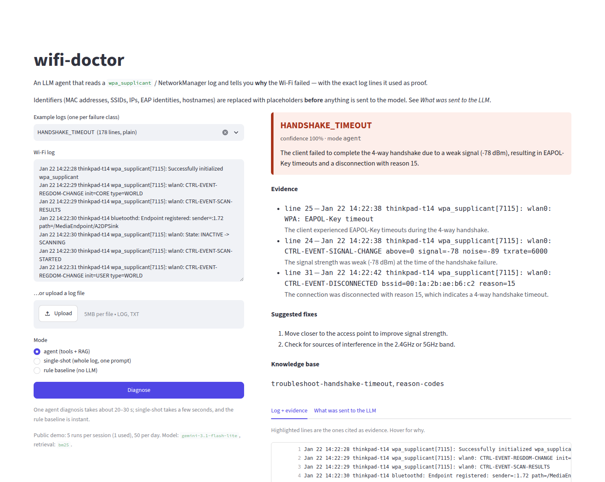
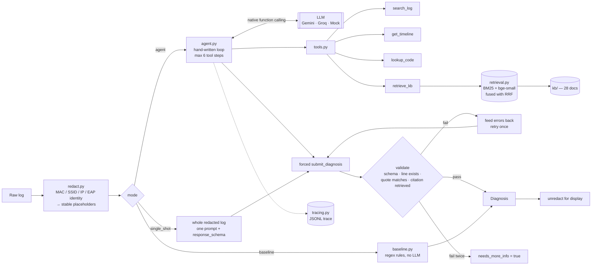

# wifi-doctor

**An LLM agent that reads a `wpa_supplicant` log and tells you why the Wi-Fi failed — and
shows you the exact lines it used as proof.**

**Live demo:** https://wifi-doctor.streamlit.app



Wi-Fi logs are long, repetitive and mostly noise, and the one line that matters is usually
indistinguishable from the twenty that do not. `wifi-doctor` gives a model four tools, a
small knowledge base, and no direct access to the log, then refuses to accept any answer
whose citations it cannot verify.

```
 in:  200 lines of wpa_supplicant / kernel / dhclient output  (test_0023)
out:  HANDSHAKE_TIMEOUT          confidence 1.0      6 API requests, 38.7k tokens

      tools called   get_timeline → search_log → lookup_code(reason,15)
                     → retrieve_kb → search_log

      evidence       line 24  CTRL-EVENT-SIGNAL-CHANGE above=0 signal=-89 noise=-89 txrate=6000
                     line 25  WPA: EAPOL-Key timeout
                     line 31  deauthenticated from <MAC_2> (Reason: 15=4WAY_HANDSHAKE_TIMEOUT)

      kb_citations   troubleshoot-handshake-timeout, disambiguation-guide, reason-codes
```

That log also contains `WPA: 4-Way Handshake failed - pre-shared key may be incorrect` —
the line a keyword matcher fires on. The agent did not take the bait: the signal is
−89 dBm, the EAPOL-Key frames timed out, and there is no `reason=WRONG_KEY`. Every field
above is copied from the real trace at
[`docs/sample_traces/agent_test_0023.jsonl`](docs/sample_traces/); the identifiers are
placeholders because that is genuinely all the model ever saw.


---

## Architecture



The loop is `_run_agent` in [`src/wifi_doctor/agent.py`](src/wifi_doctor/agent.py), about a
hundred lines.

---

## Results

<!-- RESULTS:START -->
Provider **gemini**, model **`gemini-3.5-flash-lite`**, run on **2026-09-25** against the held-out **test** split (33 logs, 245 API requests). Retrieval backend: hybrid (`BAAI/bge-small-en-v1.5`).

| metric | rule baseline | single-shot | agent |
|---|---|---|---|
| root-cause accuracy | 75.8% | 84.8% | 93.9% |
| macro-F1 | 0.697 | 0.817 | 0.938 |
| evidence precision | 82.8% | 62.1% | 68.2% |
| evidence recall | 44.9% | 45.8% | 49.2% |
| hallucinated evidence | 0.0% | 0.0% | 0.0% |
| HEALTHY false-alarm rate | 33.3% | 0.0% | 0.0% |
| missed-failure rate | 3.3% | 10.0% | 3.3% |
| schema-valid, first try | 100.0% | 100.0% | 93.9% |
| schema-valid, after retry | 100.0% | 100.0% | 100.0% |
| API requests / log | 0.00 | 1.00 | 6.42 |
| tokens / log | 0 | 11,011 | 44,041 |
| median latency / log | 0.0s | 2.4s | 25.4s |

Full report with per-class breakdowns, confusion matrices and the worst failures: [`results/2026-09-25_gemini_gemini-3.5-flash-lite/report.md`](results/2026-09-25_gemini_gemini-3.5-flash-lite/report.md).
<!-- RESULTS:END -->

### Coverage

These results cover 33 of the 66 held-out test logs (3 per class, the same 33 for every mode)
because the run hit the Gemini free tier's daily request quota. At 3 examples per class one
case moves accuracy by 3 points, so the gaps between modes are directional rather than
statistically meaningful. To finish the run once the quota resets (finished cases are cached
and not re-sent):

```bash
python eval/run_eval.py --split test --modes baseline single_shot agent \
    --provider gemini --model gemini-3.5-flash-lite
python scripts/update_readme_results.py results/<run>/metrics.json
```

**Every number above came from actually running `eval/run_eval.py`** against the real API on
the date shown, and is regenerated into this README straight from that run's `metrics.json`
by `scripts/update_readme_results.py`. Nothing here is estimated.

**What the metrics mean**

- *Evidence precision/recall* compare the line numbers the model cited against the
  generator's ground-truth evidence lines, micro-averaged over the non-`HEALTHY` cases.
  The agent's precision is below the baseline's because it cites more lines (2.8 per
  failing log against 2.1), and 25 of its 27 citations outside the ground truth are on logs
  it diagnosed correctly: neighbouring lines from the same failure sequence, such as the
  resulting `CTRL-EVENT-DISCONNECTED`, the `EAP-STARTED`/`EAP-METHOD` lines or a signal
  reading, that the minimal ground-truth set does not include.
- *Hallucinated evidence* is the share of returned citations whose line number does not
  exist or whose quote does not occur on the cited line. Validation runs before the answer
  is returned, so this measures what got through, not what was first attempted.
- *HEALTHY false-alarm rate* is how often a perfectly fine log was given a fault. A
  confident false alarm costs a support engineer more than no answer at all, so it is
  tracked separately from accuracy.
- *Schema-valid first try vs after retry* separates "the model got it right immediately"
  from "the validator caught it and the retry fixed it".

---

## Design decisions

**Why a hand-written agent loop rather than a framework.** The loop is about a hundred
lines, and every decision that matters in this project lives inside it: when tool calls stop
and the final answer is forced, what counts as a valid answer, what exactly gets fed back on
a retry, and what lands in the trace. A framework would hide precisely those decisions
behind defaults that I would then have to explain anyway.

**Why the model cannot see the log.** In agent mode the log is only reachable through
`search_log` and `get_timeline`. That is not a limitation, it is the mechanism: a model that
has never been shown line 88 cannot casually claim line 88 says something. Every citation
has to come back through a tool that returns real line numbers.

**Why a forced `submit_diagnosis` function instead of a response schema.** Gemini rejects
`tools` and `response_schema` in the same request — verified against `gemini-3.5-flash-lite`
on 2026-09-25, not assumed. Since agent mode needs the tools attached right up to the final
turn, the structured answer comes from a forced function call
(`mode="ANY", allowed_function_names=["submit_diagnosis"]`) whose parameter schema *is* the
Pydantic model. Single-shot mode has no tools, so it uses the native `response_schema`
instead. Both of Gemini's structured-output mechanisms are live in the codebase, each where
it actually fits.

**Why hybrid retrieval.** Wi-Fi troubleshooting is full of exact tokens — `status_code=17`,
`EAPOL-Key`, `Reason: 15` — and a dense model maps status 17 and status 27 to nearly the
same vector. BM25 does not. But a user typing "it keeps asking for the password again"
shares no tokens with the document that answers them, and BM25 is helpless there. Neither
retriever is sufficient, so both run and their rankings are fused with **Reciprocal Rank
Fusion**, which needs no score normalisation between two retrievers whose scores are on
incomparable scales. Embeddings are optional at runtime: if `sentence-transformers` is
missing or the model cannot be fetched, retrieval degrades to BM25-only and says so.

**Why validation and retry, rather than trusting the output.** A diagnosis nobody can check
is worth nothing in a support workflow. Three checks turn "the model said so" into something
falsifiable: the payload must parse as the Pydantic model; every cited line number must exist
*and* the quote must actually occur on that line; and every `kb_citation` must be a document
that was genuinely retrieved during this run. On failure the specific errors — including the
real text of the line that was misquoted — go back to the model for exactly one retry. If it
fails twice, the run returns `needs_more_info=true` rather than a confident guess.

This is not theoretical. On the reported run the guardrail fired on 2 of 33 agent cases
(schema-valid first try 93.9%, 100% after retry). In
[`docs/sample_traces/agent_test_0006_validation_retry.jsonl`](docs/sample_traces/) the model
cited a NetworkManager line with the right process name, the right log format and a
plausible timestamp — that did not exist. The validator compared the quote to line 41 and
rejected it with the line's real text; the retry produced a correct, checkable answer. That
is a hallucinated citation caught and repaired automatically, and it is exactly the failure
mode a diagnosis tool cannot afford to ship.

**Why redaction happens before anything is sent.** Free-tier LLM APIs generally reserve the
right to use submitted prompts to improve their products, so anything sent to one should be
treated as published. A Wi-Fi log is not neutral: a BSSID plus an SSID is a geolocatable
fingerprint — that is exactly how public BSSID-location databases are built — and an EAP
identity is somebody's username. So MACs, SSIDs, IPv4/IPv6 addresses, EAP identities,
certificate subjects, syslog usernames and hostnames are all replaced with stable
placeholders (`<MAC_1>`, `<SSID_1>`, …) *before* the text reaches a provider. Placeholders
are stable within a document, so the model can still reason about "the same AP as before",
which is most of what the identifiers were for. The mapping back to the real values stays in
the process, is never written to a trace, and is used only to render the answer for the
person who owns the log. The demo's *What was sent to the LLM* tab shows the operator the
exact bytes that left the machine.

Protocol constants such as `255.255.255.255` are deliberately **not** redacted — replacing
them would destroy meaning (a `DHCPDISCOVER` must go to the broadcast address) and protect
nobody.

One of the redaction tests, run over the whole corpus rather than over handpicked strings,
caught a real leak: the SSID reappearing inside a RADIUS certificate subject in
`CTRL-EVENT-EAP-PEER-CERT`, which no other pattern covered. That case is now a regression
test.

**Why a good-faith regex baseline.** It would be easy to make the LLM look good by comparing
it to a strawman. The baseline in `baseline.py` encodes the disambiguations a competent
engineer would write after a week of reading supplicant output — `WRONG_KEY` before EAPOL
timeouts, a roam attempt before a generic association rejection, `locally_generated=1` to
tell "we left" from "we were kicked". It is a real bar, and if the agent cannot clear it,
the agent is not worth its API calls.

---

## Limitations

- **The logs are synthetic.** They are format-faithful — real control-event names, real
  supplicant states, real IEEE 802.11 reason and status codes — but they are generated, not
  captured. A model that does well here has learned the format and the reasoning, which is
  necessary but not sufficient for real captures. See [`data/README.md`](data/README.md).
- **Eleven classes, one label per log.** Real failures overlap and cascade; a single
  mutually-exclusive root cause is a modelling simplification that makes accuracy and
  macro-F1 well defined at the cost of realism.
- **WPA2-Personal and 802.1X centric.** WPA3/SAE is documented in the knowledge base but is
  not a generated class, and SAE fails at a different point in the state machine
  (`AUTHENTICATING`, not `4WAY_HANDSHAKE`), so the trained intuitions do not transfer.
- **English-only knowledge base**, and English-only prompts.
- **Confidence is not calibrated.** On the reported run the agent's mean confidence was
  **1.00 when it was right and 1.00 when it was wrong**, so do not gate anything on it.
  Making it mean something (verbalised uncertainty, self-consistency across samples, or a
  calibrated head over the evidence count) is the most valuable next piece of work, and the
  evaluation harness already measures it.
- **One model, one day.** Everything was measured on a single provider and model on the date
  recorded, with temperature 0. No repeated-run variance is reported.
- **The agent's token cost grows with the conversation.** Tool results are resent on every
  turn, so a 400-line log with a long tool phase is markedly more expensive than a short one.

---

## Run it

Python 3.11+.

```bash
git clone https://github.com/iamgarvit/wifi-doctor && cd wifi-doctor
python -m venv .venv && source .venv/bin/activate
pip install -r requirements-dev.txt
pip install -e .

cp .env.example .env        # then put your free Gemini key in it
python scripts/generate_logs.py
```

Get a free key at <https://aistudio.google.com/apikey>. `.env` is gitignored and no key is
ever printed, logged or written to a trace.

**The demo** comes in two front ends over the same code
([`src/wifi_doctor/demo.py`](src/wifi_doctor/demo.py)); run either from the repository root:

```bash
streamlit run streamlit_app.py   # http://localhost:8501  (Streamlit Community Cloud)
python app.py                    # http://127.0.0.1:7860  (Gradio, Hugging Face Spaces)
```

One agent diagnosis takes about 25 s (median 25.4 s on the evaluation run); single-shot
takes about 2.4 s.

**One log from the command line:**

```python
from wifi_doctor.agent import diagnose
from wifi_doctor.config import get_settings
from wifi_doctor.llm import build_provider

result = diagnose(open("my.log").read(), build_provider(get_settings()))
print(result.display().model_dump_json(indent=2))
```

**The evaluation:**

```bash
# prints the estimated API-request count and refuses to start if it will not
# fit in today's remaining free-tier budget
python eval/run_eval.py --split test --modes baseline single_shot agent \
    --provider gemini --model gemini-3.5-flash-lite

python eval/run_eval.py --split test --limit 10        # a small chunk
python eval/run_eval.py --split test --modes baseline  # no API calls at all
python eval/run_eval.py --split dev --provider mock    # fully offline

python scripts/update_readme_results.py results/<run>/metrics.json
```

Every finished case is cached under `results/<run>/cache/`, so an interrupted run resumes
exactly where it stopped and never pays for the same log twice. A client-side rate limiter
paces requests (`LLM_RPM`) and a persisted daily counter enforces `LLM_RPD`; 429s are retried
with exponential backoff, honouring the provider's own `retryDelay` hint when it sends one.

**Tests:**

```bash
pytest -q          # 144 tests, fully offline (MockProvider, BM25-only retrieval)
                   # 12 need gradio and 4 need streamlit; they skip without them, as CI does
ruff check . && ruff format --check .
```

---

## Deploying the demo

### Streamlit Community Cloud (the live demo)

Hugging Face now needs a paid plan for Gradio and Docker Spaces, so the public demo runs on
Streamlit Community Cloud, which is free. At <https://share.streamlit.io> choose
**Create app → Deploy a public app from GitHub** and fill in:

| field | value |
|---|---|
| Repository | `iamgarvit/wifi-doctor` |
| Branch | `main` |
| Main file path | `streamlit_app.py` |
| App URL | `wifi-doctor` (→ `wifi-doctor.streamlit.app`) |
| Advanced settings → Python version | `3.12` |
| Advanced settings → Secrets | see below |

```toml
GEMINI_API_KEY = "your-gemini-api-key"

# Optional; these are the defaults.
# LLM_MODEL = "gemini-3.1-flash-lite"
# DEMO_MAX_RUNS_PER_SESSION = "5"
# DEMO_DAILY_CAP = "50"
# WIFI_DOCTOR_EMBEDDINGS = "0"
```

Each setting is read from `st.secrets` first, then from the environment, then from the demo
defaults. Locally the same keys can go in `.streamlit/secrets.toml` (gitignored) or `.env`.

**Why a `Pipfile`.** Community Cloud installs the first dependency file it finds, and a
`Pipfile` takes precedence over `requirements.txt`. So [`Pipfile`](Pipfile) (with its
`Pipfile.lock`) is the lightweight Streamlit set: `streamlit`, `google-genai`, `pydantic`,
`python-dotenv`, `numpy` and `rank-bm25`, with no gradio, groq, torch or
`sentence-transformers`. `requirements.txt` stays the Gradio/Hugging Face set, and
[`.streamlit/config.toml`](.streamlit/config.toml) holds the theme and upload limit.

Measured from a clean copy of the repository on Python 3.12, installed from the `Pipfile`
alone and started from the repository root as Community Cloud does: the install took 35 s
(491 MB), the app went from launch to rendered in a browser in 3.5 s, and the process's peak
memory was 125 MB after two agent diagnoses, well inside Community Cloud's 690 MB minimum.

### Hugging Face Space (the alternative, if a paid plan is enabled)

`app.py` is the same demo in Gradio. Its Space configuration (SDK, Gradio version, Python
version, app file) is the YAML front matter of [`hf_space_card.md`](hf_space_card.md), which the
deploy script uploads as the Space's `README.md`. The Space would run on **ZeroGPU** (`zero-a10g`) without using the GPU: every model call goes
to the Gemini API, it does not import torch, and nothing is decorated with `@spaces.GPU`. On
this account, creating it returned HTTP 402.

```bash
python scripts/deploy_space.py --dry-run   # the upload plan; no token, no Hub calls

pip install huggingface_hub
export HF_TOKEN=...          # a Hugging Face token with write access
export GEMINI_API_KEY=...    # stored as a Space secret, never printed
python scripts/deploy_space.py
```

[`scripts/deploy_space.py`](scripts/deploy_space.py) creates the public Space
`iamgarvit/wifi-doctor` if it does not exist, sets the `GEMINI_API_KEY` secret and the
settings below as Space variables, uploads every git-tracked file except `.env`, `.venv/`,
`runs/` and the results caches (with the card in place of this README), deletes files that
are no longer part of the upload, and waits until the Space reports `RUNNING`. Run it again to
redeploy. If the Hub refuses to create the Space (HTTP 402 or 403), the script stops without
creating anything. `.github/workflows/sync-to-hf.yml` runs the same script, but only when
started by hand from the Actions tab, and skips cleanly when the repository has no `HF_TOKEN`
secret.

### Demo configuration (both hosts)

| setting | value | why |
|---|---|---|
| `LLM_MODEL` | `gemini-3.1-flash-lite` | Gemini's free quota is per model, so the demo never spends the evaluation model's budget |
| `DEMO_MAX_RUNS_PER_SESSION` | `5` | one visitor cannot use up the day |
| `DEMO_DAILY_CAP` | `50` | about 6 API requests per diagnosis, so at most ~300 requests a day |
| `WIFI_DOCTOR_EMBEDDINGS` | `0` | BM25-only retrieval (see below) |

**The demo is not the evaluated configuration.** The results above are for
`gemini-3.5-flash-lite` with hybrid retrieval; the demo runs `gemini-3.1-flash-lite` with
BM25-only retrieval, and its footer shows both. The embedding model itself is cheap (on a
CPU container `bge-small-en-v1.5` loaded and indexed the knowledge base in about 14 s cold,
including the download, and 7 s warm, with 20 ms queries), but it needs
`sentence-transformers` and torch, which took 5.8 GB of disk to install. That is too much
to add for a 28-document knowledge base, so the demo leaves it out.

---

## Repository layout

```
src/wifi_doctor/
  schema.py      Pydantic Diagnosis model + the flat JSON Schema given to the provider
  redact.py      identifier → placeholder, and back again for display
  logparse.py    line-number-preserving parsing, and smart truncation for long logs
  tools.py       search_log, get_timeline, lookup_code, retrieve_kb
  retrieval.py   BM25 + embeddings, fused with RRF, dense index cached to disk
  llm.py         provider interface + Gemini, Groq and a deterministic Mock
  agent.py       the loop, the validator, and the single-shot ablation
  prompts.py     system and retry prompts (tuned on dev only)
  tracing.py     JSONL traces
  ratelimit.py   RPM sliding window + persisted RPD counter
  baseline.py    the regex rules the agent has to beat
  config.py      settings from .env; never prints a key
  demo.py        the demo's limits, run logic and renderers, shared by both front ends

kb/              28 markdown docs: 802.11 code tables, state machine, per-class notes
data/synthetic/  dev (44) and test (66) cases with ground-truth evidence line numbers
scripts/         log generator; README results injector; Space deploy
eval/            metrics + the evaluation CLI
tests/           144 offline tests
docs/            sample traces, demo screenshot
streamlit_app.py the Streamlit demo (Streamlit Community Cloud)
app.py           the Gradio demo (Hugging Face Spaces)
Pipfile          the Streamlit demo's dependencies; requirements.txt is the Gradio set
hf_space_card.md the Hugging Face Space's README and configuration
```

A trace is one JSONL file per run — `run_start`, then `llm_call` / `tool_call` /
`validation` events in order, then `run_end` with the totals. Samples:
[`docs/sample_traces/`](docs/sample_traces/).

---

## License

MIT.
