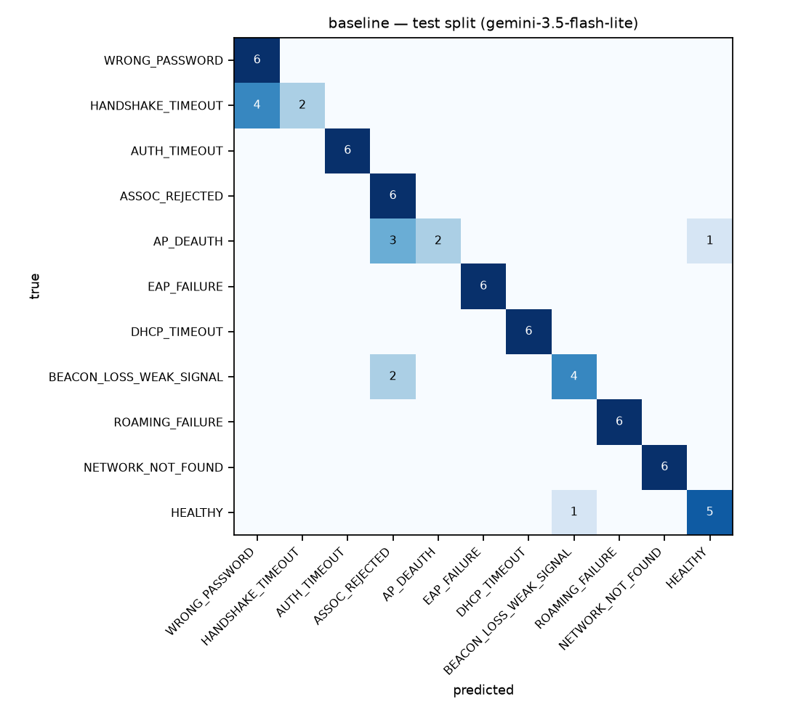
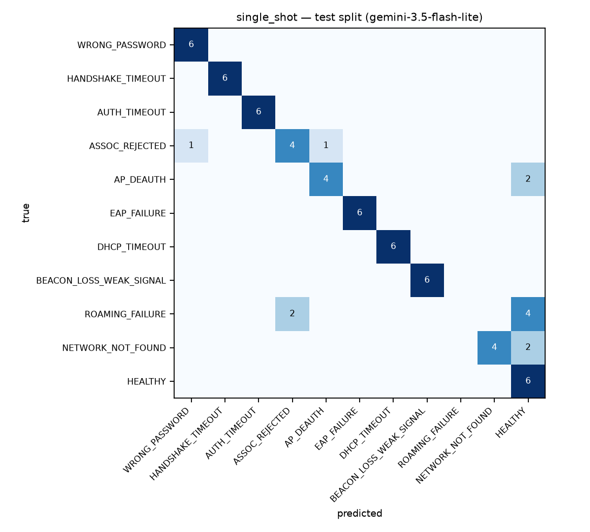
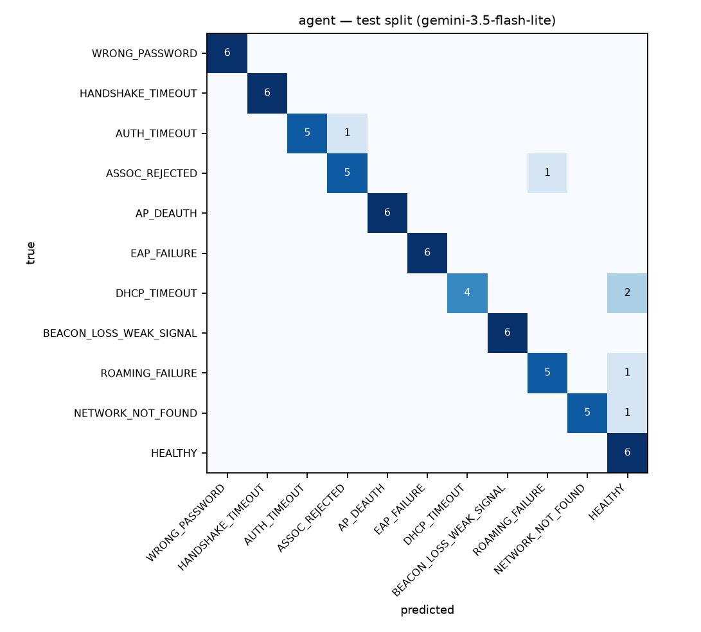

# wifi-doctor evaluation — test split

- **Date (UTC):** 2026-09-26
- **Provider / model:** `gemini` / `gemini-3.5-flash-lite`
- **Cases:** 66 from `data/synthetic/test/cases.jsonl`
- **Retrieval backend:** hybrid (`BAAI/bge-small-en-v1.5`)
- **Agent max tool steps:** 6
- **Total API requests this run:** 492

> The test split was never used to tune prompts or rules. Every number below was produced by `eval/run_eval.py`; nothing is estimated.

## Headline

| metric | `baseline` | `single_shot` | `agent` |
|---|---|---|---|
| root-cause accuracy | 83.3% | 81.8% | 90.9% |
| macro-F1 | 0.820 | 0.792 | 0.912 |
| evidence precision | 88.1% | 62.7% | 65.5% |
| evidence recall | 50.0% | 44.5% | 48.7% |
| hallucinated evidence (final) | 0.0% | 0.0% | 0.0% |
| HEALTHY false-alarm rate | 16.7% | 0.0% | 0.0% |
| missed-failure rate | 1.7% | 13.3% | 6.7% |
| schema-valid first try | 100.0% | 98.5% | 93.9% |
| schema-valid after retry | 100.0% | 100.0% | 100.0% |
| API requests / log | 0.00 | 1.02 | 6.44 |
| tokens / log | 0 | 10,372 | 42,595 |
| mean latency / log | 0.00s | 4.04s | 29.65s |
| median latency / log | 0.00s | 2.45s | 24.96s |

### How to read these

- **Evidence precision/recall** are over cited line numbers vs the generator's ground-truth lines, micro-averaged over the non-`HEALTHY` cases (a `HEALTHY` case has no ground-truth evidence, so recall is undefined for it).
- **Hallucinated evidence (final)** is the share of returned citations whose line number is out of range or whose quote does not occur on the cited line. The agent validates before returning, so this measures what survived validation, not what the model first attempted.
- **`baseline`** is the regex rule engine in `src/wifi_doctor/baseline.py`. It makes no API calls, does no retrieval, and cites no knowledge-base documents by construction.

## Mode: `baseline`



| class | support | precision | recall | F1 |
|---|---|---|---|---|
| WRONG_PASSWORD | 6 | 0.60 | 1.00 | 0.75 |
| HANDSHAKE_TIMEOUT | 6 | 1.00 | 0.33 | 0.50 |
| AUTH_TIMEOUT | 6 | 1.00 | 1.00 | 1.00 |
| ASSOC_REJECTED | 6 | 0.55 | 1.00 | 0.71 |
| AP_DEAUTH | 6 | 1.00 | 0.33 | 0.50 |
| EAP_FAILURE | 6 | 1.00 | 1.00 | 1.00 |
| DHCP_TIMEOUT | 6 | 1.00 | 1.00 | 1.00 |
| BEACON_LOSS_WEAK_SIGNAL | 6 | 0.80 | 0.67 | 0.73 |
| ROAMING_FAILURE | 6 | 1.00 | 1.00 | 1.00 |
| NETWORK_NOT_FOUND | 6 | 1.00 | 1.00 | 1.00 |
| HEALTHY | 6 | 0.83 | 0.83 | 0.83 |

Accuracy by difficulty variant: `heavy_noise` 100.0% (n=8), `misleading` 80.0% (n=20), `plain` 86.7% (n=15), `transient_recovery` 66.7% (n=12), `truncated` 90.9% (n=11)

Mean confidence when correct **0.78**, when wrong **0.78**; `needs_more_info` set on 0.0% of cases.

### 5 worst failures (wrong, ranked by how confident it was)

| case | variant | truth | predicted | conf | trace |
|---|---|---|---|---|---|
| `test_0001` | plain | HANDSHAKE_TIMEOUT | WRONG_PASSWORD | 0.90 | — |
| `test_0012` | transient_recovery | HANDSHAKE_TIMEOUT | WRONG_PASSWORD | 0.90 | — |
| `test_0023` | misleading | HANDSHAKE_TIMEOUT | WRONG_PASSWORD | 0.90 | — |
| `test_0034` | truncated | HANDSHAKE_TIMEOUT | WRONG_PASSWORD | 0.90 | — |
| `test_0004` | plain | AP_DEAUTH | HEALTHY | 0.75 | — |

## Mode: `single_shot`



| class | support | precision | recall | F1 |
|---|---|---|---|---|
| WRONG_PASSWORD | 6 | 0.86 | 1.00 | 0.92 |
| HANDSHAKE_TIMEOUT | 6 | 1.00 | 1.00 | 1.00 |
| AUTH_TIMEOUT | 6 | 1.00 | 1.00 | 1.00 |
| ASSOC_REJECTED | 6 | 0.67 | 0.67 | 0.67 |
| AP_DEAUTH | 6 | 0.80 | 0.67 | 0.73 |
| EAP_FAILURE | 6 | 1.00 | 1.00 | 1.00 |
| DHCP_TIMEOUT | 6 | 1.00 | 1.00 | 1.00 |
| BEACON_LOSS_WEAK_SIGNAL | 6 | 1.00 | 1.00 | 1.00 |
| ROAMING_FAILURE | 6 | 0.00 | 0.00 | 0.00 |
| NETWORK_NOT_FOUND | 6 | 1.00 | 0.67 | 0.80 |
| HEALTHY | 6 | 0.43 | 1.00 | 0.60 |

Accuracy by difficulty variant: `heavy_noise` 100.0% (n=8), `misleading` 80.0% (n=20), `plain` 93.3% (n=15), `transient_recovery` 50.0% (n=12), `truncated` 90.9% (n=11)

Mean confidence when correct **0.99**, when wrong **0.95**; `needs_more_info` set on 0.0% of cases.

### 5 worst failures (wrong, ranked by how confident it was)

| case | variant | truth | predicted | conf | trace |
|---|---|---|---|---|---|
| `test_0008` | plain | ROAMING_FAILURE | HEALTHY | 1.00 | `results/2026-09-25_gemini_gemini-3.5-flash-lite/traces/single_shot/test_0008.jsonl` |
| `test_0026` | misleading | AP_DEAUTH | HEALTHY | 1.00 | `results/2026-09-25_gemini_gemini-3.5-flash-lite/traces/single_shot/test_0026.jsonl` |
| `test_0052` | transient_recovery | ROAMING_FAILURE | HEALTHY | 1.00 | `results/2026-09-25_gemini_gemini-3.5-flash-lite/traces/single_shot/test_0052.jsonl` |
| `test_0053` | misleading | NETWORK_NOT_FOUND | HEALTHY | 1.00 | `results/2026-09-25_gemini_gemini-3.5-flash-lite/traces/single_shot/test_0053.jsonl` |
| `test_0059` | transient_recovery | AP_DEAUTH | HEALTHY | 1.00 | `results/2026-09-25_gemini_gemini-3.5-flash-lite/traces/single_shot/test_0059.jsonl` |

## Mode: `agent`



| class | support | precision | recall | F1 |
|---|---|---|---|---|
| WRONG_PASSWORD | 6 | 1.00 | 1.00 | 1.00 |
| HANDSHAKE_TIMEOUT | 6 | 1.00 | 1.00 | 1.00 |
| AUTH_TIMEOUT | 6 | 1.00 | 0.83 | 0.91 |
| ASSOC_REJECTED | 6 | 0.83 | 0.83 | 0.83 |
| AP_DEAUTH | 6 | 1.00 | 1.00 | 1.00 |
| EAP_FAILURE | 6 | 1.00 | 1.00 | 1.00 |
| DHCP_TIMEOUT | 6 | 1.00 | 0.67 | 0.80 |
| BEACON_LOSS_WEAK_SIGNAL | 6 | 1.00 | 1.00 | 1.00 |
| ROAMING_FAILURE | 6 | 0.83 | 0.83 | 0.83 |
| NETWORK_NOT_FOUND | 6 | 1.00 | 0.83 | 0.91 |
| HEALTHY | 6 | 0.60 | 1.00 | 0.75 |

Accuracy by difficulty variant: `heavy_noise` 87.5% (n=8), `misleading` 90.0% (n=20), `plain` 100.0% (n=15), `transient_recovery` 75.0% (n=12), `truncated` 100.0% (n=11)

Mean confidence when correct **1.00**, when wrong **1.00**; `needs_more_info` set on 0.0% of cases.

### 5 worst failures (wrong, ranked by how confident it was)

| case | variant | truth | predicted | conf | trace |
|---|---|---|---|---|---|
| `test_0013` | misleading | AUTH_TIMEOUT | ASSOC_REJECTED | 1.00 | `results/2026-09-25_gemini_gemini-3.5-flash-lite/traces/agent/test_0013.jsonl` |
| `test_0028` | transient_recovery | DHCP_TIMEOUT | HEALTHY | 1.00 | `results/2026-09-25_gemini_gemini-3.5-flash-lite/traces/agent/test_0028.jsonl` |
| `test_0036` | transient_recovery | ASSOC_REJECTED | ROAMING_FAILURE | 1.00 | `results/2026-09-25_gemini_gemini-3.5-flash-lite/traces/agent/test_0036.jsonl` |
| `test_0052` | transient_recovery | ROAMING_FAILURE | HEALTHY | 1.00 | `results/2026-09-25_gemini_gemini-3.5-flash-lite/traces/agent/test_0052.jsonl` |
| `test_0061` | heavy_noise | DHCP_TIMEOUT | HEALTHY | 1.00 | `results/2026-09-25_gemini_gemini-3.5-flash-lite/traces/agent/test_0061.jsonl` |

## Reproducing

```bash
python eval/run_eval.py --split test --modes baseline single_shot agent --provider gemini --model gemini-3.5-flash-lite --out results/2026-09-25_gemini_gemini-3.5-flash-lite
```
